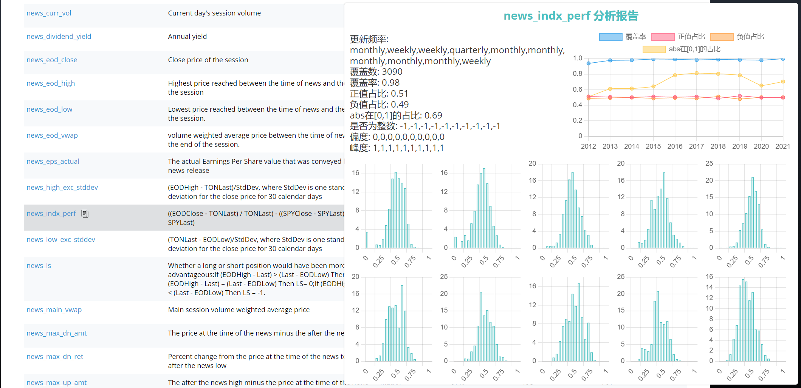

# WebDataScope
WebDataScope是一个正在为WorldQuant平台打造的Chrome/Edge插件。它可以让你在WorldQuant平台上方便的获得其数据分析报告
<!--  -->

# 使用方式
下载这个project，然后在`chrome://extensions`中加载

`data`文件夹不在该repo中提供

# 功能
当在数据页面浏览时，鼠标移至数据行上可以显示相应数据的分析报告（只覆盖了部分数据）

# TODO
- [ ] simulation->Data中的数据展示

# 更新日志
- V
  - 更新`region`,`delay`和`universe`的获取逻辑，避免获取失败
  - 添加`alpha`->`distribution`的分析图

- V0.2.0(20240314)
  - 适配Edge浏览器
  - 启用数据缓存策略，提高加载速度
  - 禁用画图动画效果

- V0.1.0(20240311)
  - 完成插件主体内容

# Reference
- [BiliScope](https://github.com/gaogaotiantian/biliscope)

# 致谢
- 感谢群里同学们提供的分析数据